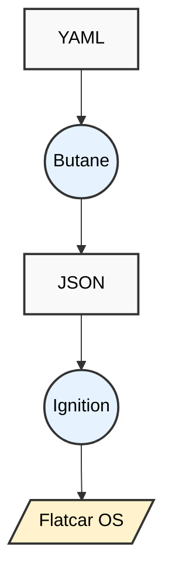

# Flatcar First Boot & Provisioning

Flatcar is configured at first boot only using declarative configurations. This section describes the following provisioning tools and configuration tasks:

| Tool or Task | Description |
| --- | --- |
| [Butane](./butane/_index.md) | Butane transforms a user-provided Butane Configuration into an Ignition configuration. |
| [cl-config] | (DEPRICATED) YAML configuration format used to generate Ignition configs.|
| [Customize image](./customize-image/_index.md) | Describes mounting a partition for customization. |
| [Ignition](./ignition/_index.md) | Provisioning utility specially designed for Container OSs. |

## How Provisioning Works

You don't install Flatcar, you provision it The following diagram illustrates the workflow for Flatcar provisioning.




Flatcar recommends that you provision your Linux container by following these steps:

1. Write a YAML configuration file for the Butane transpiler app following using a YAML configuration files. See [Butane examples](./butane/examples.md).
1. Run Butane using the YAML config file.
1. Run Ignition using the JSON config file.
1. Your Flatcar Linux container will be created.


> [!NOTE]
> Although you can craft the JSON config file manually, using Butane with a YAML configuration is recommended to avoid errors.

## Provisioning Code Example

### How to write your first config and test it locally in a QEMU VM

It's easy to provision a container using a Butane YAML config file and Ignition into a local QEMU VM. First you create a systemd service that starts an NGINX container as an example configuration for the VM. This is a good starting point for you to modify the Butane YAML file and test it by provisioning a temporary QEMU VM. This should work on most Linux systems and assumes you have an SSH key set up for ssh-agent.

Begin by downloading the Flatcar QEMU image and the helper script to start it with QEMU, but don’t run it yet.

#### AMD64:

```bash
wget https://stable.release.flatcar-linux.net/amd64-usr/current/flatcar_production_qemu.sh

chmod +x flatcar_production_qemu.sh

wget https://stable.release.flatcar-linux.net/amd64-usr/current/flatcar_production_qemu_image.img
```

#### ARM64:

```bash
wget https://alpha.release.flatcar-linux.net/arm64-usr/current/flatcar_production_qemu_uefi.sh

chmod +x flatcar_production_qemu_uefi.sh

wget https://alpha.release.flatcar-linux.net/arm64-usr/current/flatcar_production_qemu_uefi_image.img

wget https://alpha.release.flatcar-linux.net/arm64-usr/current/flatcar_production_qemu_uefi_efi_vars.qcow2

wget https://alpha.release.flatcar-linux.net/arm64-usr/current/flatcar_production_qemu_uefi_efi_code.qcow2
```

For Ignition configurations to be recognized we have to make sure that we always boot an unmodified fresh image because Ignition only runs on first boot. Therefore, before trying to use an Ignition config we will always discard the image modifications by using a fresh copy. You can already boot the image with `./flatcar_production_qemu.sh` and have a look around in the OS through the QEMU VGA console - you can close the QEMU window or stop the script with `Ctrl-C`.

```bash
mv flatcar_production_qemu_image.img flatcar_production_qemu_image.img.fresh

# If you want to have a first look, boot it and wait for the autologin to give you a prompt:

cp -i --reflink=auto flatcar_production_qemu_image.img.fresh flatcar_production_qemu_image.img
```

Now we will provision the VM on first boot through Ignition. Instead of writing the JSON config we use Butane YAML and transpile it. Save the following Butane YAML file as `cl.yaml` (or another name). It contains directives for setting up a systemd service that runs an NGINX Docker container:

```YAML
variant: flatcar

version: 1.0.0

systemd:

 units:

   - name: nginx.service

     enabled: true

     contents: |

       [Unit]

       Description=NGINX example

       After=docker.service

       Requires=docker.service

       [Service]

       TimeoutStartSec=0

       ExecStartPre=-/usr/bin/docker rm --force nginx1

       ExecStart=/usr/bin/docker run --name nginx1 --pull always --log-driver=journald --net host docker.io/nginx:1

       ExecStop=/usr/bin/docker stop nginx1

       Restart=always

       RestartSec=5s

       [Install]

       WantedBy=multi-user.target
```

Before we can use it we have to transpile the Butane YAML to Ignition JSON:

```bash
cat cl.yaml | docker run --rm -i quay.io/coreos/butane:latest > ignition.json
```

You can also skip this step and copy the resulting JSON file from here to `ignition.json `(or another name):

Before we can use it we have to transpile the Butane YAML to Ignition JSON:
cat cl.yaml | docker run --rm -i quay.io/coreos/butane:latest > ignition.json


You can also skip this step and copy the resulting JSON file from here to ignition.json (or another name):

```YAML
{

 "ignition": {

   "version": "3.3.0"

 },

 "systemd": {

   "units": [

     {

       "contents": "[Unit]\nDescription=NGINX example\nAfter=docker.service\nRequires=docker.service\n[Service]\nTimeoutStartSec=0\nExecStartPre=-/usr/bin/docker rm --force nginx1\nExecStart=/usr/bin/docker run --name nginx1 --pull always --net host docker.io/nginx:1\nExecStop=/usr/bin/docker stop nginx1\nRestart=always\nRestartSec=5s\n[Install]\nWantedBy=multi-user.target\n",

       "enabled": true,

       "name": "nginx.service"

     }

   ]

 }

}
```

The final step is to boot the VM and make the Ignition configuration available to it. As said, the provisioning will only be done on first boot and if you want your (changed) Ignition configuration to be used, you have to boot from a fresh copy. You can repeat these combined steps as often as you want to test your Ignition changes.

#### Make sure we boot a fresh copy:

```bash

cp -i --reflink=auto flatcar_production_qemu_image.img.fresh flatcar_production_qemu_image.img

./flatcar_production_qemu.sh -i ignition.json
```

#### Log in via SSH in a new terminal tab:

```bash
ssh -o StrictHostKeyChecking=no -o UserKnownHostsFile=/dev/null -p 2222 core@127.0.0.1
```

#### Check that NGINX is running:

```bash
systemctl status nginx

curl http://localhost/
```

> [!NOTE]
> For SSH access, you can also use the `~/.ssh/config` provided in the QEMU section then simply `ssh flatcar` or `scp my-file flatcar:/home/core` to send a file on the instance over SSH.

If you have trouble SSHing into the VM, `./flatcar_production_qemu.sh` might have failed to auto-detect your ssh key. If that happens try with a user-supplied SSH key using the yaml snippet below. Alternatively, you can interact with the VM via the VGA console - the console has auto-login enabled and drops right into a shell.

You can reboot and stop the VM if you like - when you start it later with a plain `./flatcar_production_qemu.sh` then our systemd unit will take care of starting NGINX on each boot. Note that the ignition config will only be processed on the very first boot - that’s why we made a copy, so now we can restore our OS image from the pristine copy for successive experiments with Butane.

As listed in the introduction above there are numerous options available for configuring Flatcar just the way you need it. For instance, you can specify a custom SSH key instead of your default one from your ssh-agent or from ~/.ssh/ in the Butane config, by adding this section to your YAML file:

```YAML
variant: flatcar

version: 1.0.0

passwd:

 users:

   - name: core

     ssh_authorized_keys:

       - ssh-rsa AAAAB......xyz email@host.net
```

Afterwards, transpile it again to Ignition JSON, overwrite `flatcar_production_qemu_image.img` with the fresh image file, and pass the ignition config to `./flatcar_production_qemu.sh` once again.

### Quick Iterations with QEMU

When you boot the image file and apply the Ignition config, the image is set. You would have to reprovision the image to have a new state. However, you can take advantage of the QEMU -snapshot flag that starts up the image, but it does not save the changes to the image file. This can be useful if you want to quickly reprovision locally, without having to keep swapping the underlying image file to a fresh one.

Here is an example of the syntax needed to use this flag:

```bash
./flatcar_production_qemu_uefi.sh -i config.ign -p 2224 -- -snapshot -m 4096
```

See the [QEMU documentation](https://www.qemu.org/docs/master/system/qemu-manpage.html) for more information.


## Provisioning Tool Summary

Butane and Ignition are the recommended tools to provision Flatcar Container Linux at first boot. First write a YAML configuration file for the Butane transpiler. Next run Butane to transpile the file into a JSON config file. Then use the JSON file to run Ignition to provision your container.

**Note:** The standalone Container Linux Config tool is a legacy utility inherited from the original CoreOS project and is no longer supported. While historical documentation is still available, it should not be used for new deployments. Please use Butane instead. However, the poseidon/ct Terraform provider is fully supported and recommended. Despite retaining the legacy "ct" name for backward compatibility, the provider was updated to use the modern Butane engine under the hood. We use this exact provider in our official [Terraform provisioning tutorial](https://www.flatcar.org/docs/latest/provisioning/terraform/).


