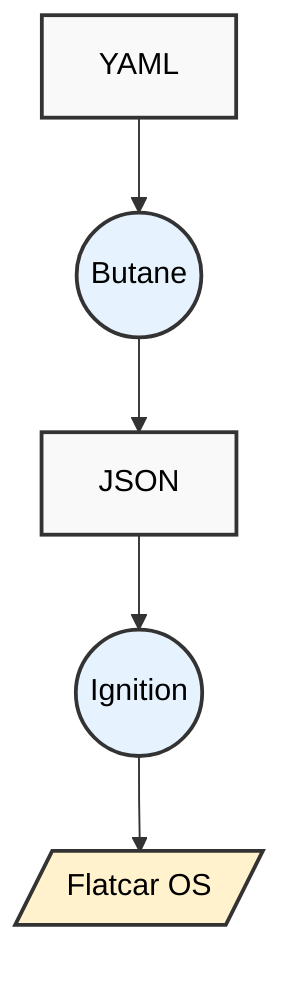

# Flatcar First Boot & Provisioning

Flatcar is configured at first boot only using declarative configurations. This section describes the following provisioning tools and configuration tasks:

| Tool or Task | Description |
| --- | --- |
| [Butane](./butane/_index.md) | Butane transforms a user-provided Butane Configuration into an Ignition configuration. |
| [cl-config] | (DEPRICATED) YAML configuration format used to generate Ignition configs.|
| [Customize image](./customize-image/_index.md) | Describes mounting a partition for customization. |
| [Ignition](./ignition/_index.md) | Provisioning utility specially designed for Container OSs. |

## How Provisioning Works

You don't install Flatcar, you provision it The following diagram illustrates the workflow for Flatcar provisioning.

Flatcar recommends that you provision your Linux container by following these steps:

1. Write a YAML configuration file for the Butane transpiler app following using a YAML configuration files. See [Butane examples](./butane/examples.md).
1. Run Butane using the YAML config file.
1. Run Ignition using the JSON config file.
1. Your Flatcar Linux container will be created.

> [!NOTE]
> Although you can craft the JSON config file manually, using Butane with a YAML configuration is recommended to avoid errors.

