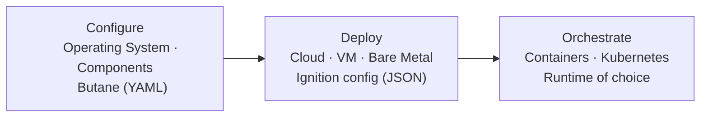

This section helps you get up and running with Flatcar. It introduces essential
concepts and points you to hands-on learning resources:

- [Flatcar Quickstart](./quickstart/) - Provision Flatcar locally in a QEMU
  virtual machine.
- [Learning Series](./learning-series/) - In-depth guides for core Flatcar
  topics.

## Configuration and Provisioning

Flatcar is configured at provisioning time, before the first boot, using
workflows as depicted in the following diagram:

- [Butane](../fb-provision/butane/) is human-readable YAML that must be
  converted (transpiled) into Ignition config before Flatcar can use it.
  Download from
  [CoreOS Butane Releases](https://github.com/coreos/butane/releases). For a
  comprehensive discussion of available options, see the
  [Butane configuration specification](../fb-provision/butane/configuration).
- [Ignition](../fb-provision/ignition/boot-process) is machine-readable JSON
  consumed by Flatcar's first-boot provisioning service. Cloud providers supply
  the Ignition config as user data or custom data suitable for private cloud and
  bare-metal installs. Ignition config is rarely written by hand and best
  practice is to generate it using automation or transpile it from Butane.

See the [Flatcar Quickstart](./quickstart/) for a detailed procedure on using
these tools.

### Automatic updates

Flatcar automatic updates are enabled by default, but you can reconfigure and
disable update settings at any time. Instances download and stage new OS
versions in the background and can reboot into the updated OS when an update
becomes available. To change this default behavior, including defining reboot
windows or disabling reboots, see
[update strategies](../updates-releases/releases/update-strategies).

## To Learn More

The Flatcar documentation covers several technical areas. Use the following
lists of functional areas to assist in your learning path.

Provisioning and Deployment:

- [First Boot & Provisioning](../fb-provision/)
- [OS Configuration](../os-config/)
- [System Extensions](../sys-ext/)
- [Deployments](../deploy/)

Orchestration and Capabilities:

- [Orchestration & Container Runtimes](../orchestrate/)
- [Nebraska Update Manager & Releases](../updates-releases/)
- [Security](../security/)

Maintenance and Development:

- [Diagnostics and Fixing Issues](../diagnostics/)
- [CoreOS Migration](../coreos-migration/)
- [Developer Guides](../devguide/)
