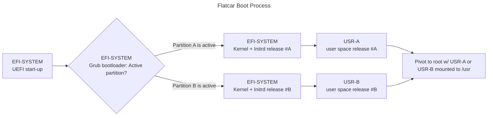
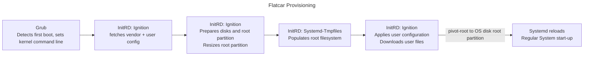
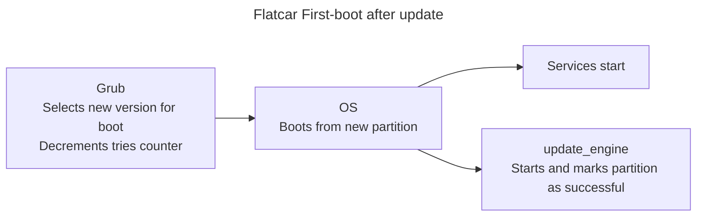
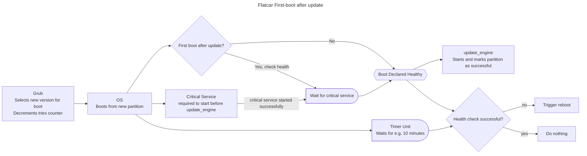

In this session, we’ll do a deep dive into Flatcar's immutability and partition layout, and dissect the operating system's start-up process.
Building on this, we'll do a deep dive into the update process, run an in-place upgrade, and configure an automated roll-back.
Lastly, we'll discuss Flatcar release channels and the release stabilisation process.

The session will cover immutability, boot, provisioning, and A/B partition layout first.
While a bit dry, these are necessary to understand the innerworks of in-place updates.

## Prerequisites

The session builds on the session "Basic Operation and Local Testing".
It assumes you
- have created a local test environment.
- are able to start ephemeral Flatcar VMs.
- know how to transpile Butane YAML to Ignition JSON.
- pass Ignition JSON configuration to a VM at launch.

## Download a *previous* OS release

In the Basics session, we downloaded the latest Alpha.
Since we want to perform live in-place updates in this session, we need to use a less-than-latest release.

Go to https://www.flatcar.org/releases/#alpha-release, scroll down a bit until you find the second-to-latest release, and click the link corresponding to your host architecture (amd64 or arm64).

As before, download

* `flatcar_production_qemu_uefi.sh` which we also need to make executable
* `flatcar_production_qemu_uefi_efi_code.qcow2`
* `flatcar_production_qemu_uefi_efi_vars.qcow2`
* `flatcar_production_qemu_uefi_image.img`

Or use the bash automation below.
Adjust `release` and `arch` to your needs.

```sh
# replace with second-latest Alpha release number (or just use as-is, as this release should be "old enough")
release='4230.0.0'
# amd64 or arm64
arch='amd64'
```

Then run

```sh
wget https://alpha.release.flatcar-linux.net/"${arch}"-usr/"${release}"/{flatcar_production_qemu_uefi.sh,flatcar_production_qemu_uefi_efi_code.qcow2,flatcar_production_qemu_uefi_efi_vars.qcow2,flatcar_production_qemu_uefi_image.img}

chmod 755 flatcar_production_qemu_uefi.sh 
```

## Flatcar Partition Layout

For our first boot, we don't actually want the update client to interfere with us.
It will check for updates regularly, and stage and reboot by default.
We can avoid that by simply not starting the update client.

```yaml
...
systemd:
  units:
    - name: update-engine.service
      mask: true
    - name: locksmithd.service
      mask: true
...
```

Let's add this to the web service from our "Basics" session!
It's always a good thing to have an actual service running.

<details>
<summary>Complete Butane YAML for convenience</summary>

```yaml
variant: flatcar
version: 1.0.0
systemd:
  units:
    - name: update-engine.service
      mask: true
    - name: locksmithd.service
      mask: true
    - name: nginx.service
      enabled: true
      contents: |
        [Unit]
        Description=NGINX example
        After=docker.service
        Requires=docker.service
        [Service]
        TimeoutStartSec=0
        ExecStartPre=-/usr/bin/docker rm --force nginx1
        ExecStart=/usr/bin/docker run --name nginx1 --pull always --log-driver=journald --net host docker.io/nginx:1
        ExecStop=/usr/bin/docker stop nginx1
        Restart=always
        RestartSec=5s
        [Install]
        WantedBy=multi-user.target
```

</details>

<br />

Then transpile and start.
```sh
cat nginx.yaml | docker run --rm -i quay.io/coreos/butane:latest > nginx.json 
./flatcar_production_qemu_uefi.sh -i nginx.json -f 12345:80 -- -nographic -snapshot
```

**NOTE** We'll require `root` access for most of what we do in this session, as we're introspecting sensitive areas of the system.
Once the VM finished booting, use
```sh
sudo -i
```
to switch to the root account.

Leave the VM running for interactively exploring the Flatcar OS.

### Immutable operating system

All of Flatcar's binaries reside in `/usr`.
`/usr` is on a separate partition, and that partition is strictly read-only.
Everything else is either sym-linked into `/usr`- like `/bin`, `/sbin`, `/lib`, and `/lib64`.
Or it is generated at first boot (see the tmpfiles step below).

Check it out!
```sh
ls -la /
```

Try creating a file in `/usr`:
```sh
echo 'test' > /usr/testfile
```

Let's check out how the OS disk is used. Which partitions of the OS disk are mounted?
```sh
mount | grep vda
```

Wait, `/` and `/oem` are there, but not `/usr`?
Well, this needs a bit of detective work.

First, we can verify `/usr` *is*, in fact, based on a partition on `/dev/vda`:
```sh
rootdev -s /usr
```

returns `vda3`. But why doesn't it show up in our mounts?

Let's check what is actually mounted on `/usr`:
```sh
mount | grep -w /usr
```

Let's ignore the `systemd-sysext` line for now; we'll elaborate on this in a later session.
So `/usr` is handled by devicemapper, more specifically
```sh
ls -la /dev/mapper/usr
```

it's `dm-0`. Let's ask the device mapper about it, then:
```sh
dmsetup status /dev/dm-0
```

OOOoohh, it's a [dm-verity](https://docs.kernel.org/admin-guide/device-mapper/verity.html) device!
- DM-Verity is a special Device Mapper storage that is guaranteed to be read-only - in fact, verity of the storage bits is guarded by cryptographic checksums.
- DM-Verity was added to the Linux kernel in 2011 by [Netflix and Google](https://lwn.net/Articles/459420/), and is used in Chromebooks - which share  ancestry with Flatcar.

So let's see which partition `dm-0` is actually using:
```sh
veritysetup status usr
```

Right, it's `/dev/vda3`.

So dm-verity inserts itself by means of a device mapper layer between the physical `vda3` and what's mounted on `/usr`.

For now we have:

* `/` backed by `vda9`- the root partition. This is populated at first boot; we'll discuss in a second how exactly that happens. There's also a reason why it is the last partition in the table. Find out more below.
* `/oem` backed by `vda6` contains vendor specific tools (think `wa-agent` in the Azure image, or `amazon-ssm-agent` for AWS).
* `/usr` is a device mapper storage 
  * backed by `dm-0`, the verity layer, which is
  * backed by `vda3`, the currently active OS partition.

There are other partitions, some of which are reserved and are currently not in use. EFI-SYSTEM, ROOT, USR-A / USR-B, and OEM are the most interesting ones.

Let's look at the boot process to better understand how these partitions interoperate.

## Flatcar Boot Process



The boot process is quite similar to regular Linux start-up, with minor Flatcar specific changes.

1. `EFI-SYSTEM` or `BIOS-BOOT` ==> `EFI-SYSTEM` (on legacy BIOS machines) UEFI (or grub BIOS stub on legacy systems) starts, the system performs basic hardware initialisation, then loads..
2. `EFI-SYSTEM` Grub, the bootloader. Grub reads its configuration and determines which kernel+initrd to load and which OS (`USR`) partition to use, based on GPT attributes of both `USR-A` and `USR-B` partitions. It loads kernel and initrd into RAM, then starts the kernel (passing the correct USR partition via kernel command line)
3. `EFI-SYSTEM` Kernel and init-ramdisk run in memory. This is when Ignition fetches its configuration and executes on it.
4. `USR-A` or `USR-B` Root FS is prepared and set up. `/usr` is mounted.
5. Ignition finishes, root is switched from the initrd to the root filesystem, and systemd reloads all services.
6. `ROOT` and `USR-*` Regular system services start.

Flatcar's OS disk (see [partition table](../developer-guides/sdk-disk-partitions/#partition-table) in our public docs) contains 2 separate partitions for OS user spaces. The respective two kernel+initrd blobs are stored together in the `EFI-SYSTEM` partition.

Let's explore ourselves!

Since we're using qemu (which uses `virtio` devices), the OS disk is `vda`.
Let's list the partitions first.

```sh
gdisk -l /dev/vda
```

`USR-A` and `USR-B` both are OS partitions.
One is considered the "active" partition, the other is "spare" and will be used to stage updates.
These partitions contain the whole of the user space.
The corresponding kernel and initrd are stored in the EFI partition mounted on `/boot`.
Let's take a look.

```sh
ls -la /boot/flatcar/
```

Currently there's only one kernel+initrd - `vmlinuz-a` since we just provisioned a fresh system that never updated.

**Which partition is active?**

Let's pretend we're Grub, the bootloader.
We need to decide which kernel to boot!
For this, we can check which `USR` partition is the currently active one.
From Flatcar user space we can use the `cgpt` tool:

```sh
cgpt show /dev/vda
```

and looking for the `Attr` lines in for both partitions the output. The active one should show

```
Attr: priority=1 tries=0 successful=1
```

We can see that `USR-A` has priority, and has booted successfully.
Therefore, the kernel+initrd from `vmlinuz-a` and user space from `USR-A` currently make up the OS version we're running.

### Flatcar Provisioning Process

Flatcar's first boot is special.
The system is initialised and user configuration is applied at first boot.



### Populate root: Flatcar's first boot

First boot is determined by Grub.
It checks for the presence of a [file ](https://github.com/flatcar/scripts/blob/main/build_library/grub.cfg#L60)`/flatcar/first_boot` in the `EFI-SYSTEM` partition and sets a kernel command line option respectively.
This file is removed later, after provisioning finished.

#### System Provisioning runs from the initrd

If first boot is detected in the initrd, the `ignition` provisioning agent is started.
Ingition fetches vendor specific configuration - think username / ssh key, network configuration etc. that you can set up e.g. via the Azure Portal when launching a VM - and "user data".
User data is expected to be in Ignition JSON format - exactly what we've been transpiling to for our web service and "don't update" configurations.

Ignition initialises storage devices and file systems - which can be customised and modified from user data configuration, as we'll learn in a later session.
It also resizes the root partition to fill all of the OS disk.
This is the reason why the root partition is at the very end of Flatcar's OS disk partition list (`vda9`).

#### System defaults - tmpfiles that are not temporary

In a second stage, and also from the initrd, a service called `systemd-tmpfiles` creates all files and directories required in the root filesystem outside of `/usr`. `systemd-tmpfiles` is a great tool that suffers from less-than-optimal naming, in that it doesn't actually handle temporary files. `systemd-system-files-manager` would be a better, though slightly too verbose. name. The misnomer even led to [adventurous users inadvertently deleting their home directory](https://github.com/systemd/systemd/issues/33349), a documentation issue later [addressed by systemd maintainers](https://github.com/systemd/systemd/pull/33383).

If you like to check out for yourself how Flatcar uses `systemd-tmpfiles`, just list the tempfiles configuration we ship with each release:

```sh
ls /usr/lib/tmpfiles.d/
```

and check them out individually.

For instance, if you'd like to see who's creating the symlinks from `/bin` and `/sbin` into `/usr`, consult `baselayout-usr.conf`.

```sh
cat /usr/lib/tmpfiles.d/baselayout-usr.conf
```

#### Applying user customisation

Lastly, after the "distro" files and directories were created, all file-based user customisations are applied.
This includes creating users, groups, and files, and downloading user content specified in Ignition configuration.
Systemd units specified in user data will be created and existing units will be modified in accordance with the user's configuration.

In our configuration above, this includes disabling (masking) the `update-engine` and `locksmithd` services, creating a new service unit based on the inline configuration for our NGINX service, and marking that service active.

### Pivot Root

After preparing the root partition and rendering all files not shipped in the Flatcar OS image in `/usr`, the system changes its filesystem root from the in-memory initrd to the actual root filesystem.
At that point, Systemd reloads all service files.
Services and modifications to services (drop-ins, masks, enablement) shipped with Ignition configuration are now considered and become active as the system boots normally.

## In-Place Updates

**Flatcar OS updates need-to-know**

- **Automated / unattended**. Updates are staged in the background, while the system is running. Since updates need a reboot to activate, various mechanisms for controlling node reboots are provided.
- **Atomic**. There is no intermediate state (think: half of the new packages were installed, then suddenly there's a power shortage). OS version 1 before reboot, OS version 2 afterwards.
- **100% reversible**. You can roll back to the previous version in case of issues, to boot into a known-good environment. Roll-backs are automatable / customisable to your needs, and atomic too.
- **Update from any version to any (newer) version**. Flatcar can be updated from any previous release to the latest release.

After all that theory we'll now *FINALLY* get back to some more hands-on stuff.
This is the reason we downloaded a *previous* OS release.
So let's go and update!

First, open a browser and point it to [http://localhost:12345](http://localhost:12345).
Oh yeah, our NGINX demo. It's still alive!

Now, on Flatcar, unmask and enable the update client `update_engine`.
Note that while binaries and commands use underscores `_`, the systemd unit uses a dash `-`.
Use systemctl to start the client:

```sh
systemctl unmask update-engine
systemctl enable --now update-engine
```

The service now runs in the background and will regularly (default: hourly) check for updates.
We can query its status via

```sh
update_engine_client -status
```

It's most likely idle right now. We can ask it to check for an update:

```
update_engine_client -check-for-update
```

It is expected to find an update since we downloaded an old version.
We can run

```sh
update_engine_client -status
```

to follow the download process: `CURRENT_OP` will be `UPDATE_STATUS_DOWNLOADING`, and `PROGRESS` will display the download progress in fractures of 1 (e.g. 0.5 equals 50%, 1 equals 100%).

Eventually, `CURRENT_OP` switch to `UPDATE_STATUS_UPDATED_NEED_REBOOT`.
This means the update has been verified and stored in the spare partition.

We can even see the new kernel+initrd stored in the `EFI-SYSTEM` partition:

```sh
ls -la /boot/flatcar/
```

Let's check partition attributes while we're at it:

```sh
cgpt show /dev/vda
```

and we see that now, `USR-B` has a priority higher than `USR-A`.
`tries=1` is used by the bootloader to check how many tries to boot into that partition are left.
It will be decremented by the bootloader before starting the kernel.

Before we reboot, let's note down the OS version and the kernel version we're on:

```
cat /etc/os-release
uname -a
```

Now let's activate the update:

```
reboot
```

Make sure you're root, then run

```
cat /etc/os-release
uname -a
```

and compare with your notes.

And check if our service is running on [http://localhost:12345](http://localhost:12345)!

Lastly, let's consult partition table attributes:

```sh
cgpt show /dev/vda
```

We see that `USR-B` now is active (higher priority than `USR-A`) *and* "successful".
This is because `update_engine` makes sure the `successful` attribute is set when it starts.

### Critical Services and Updates: Automating Roll-Backs

The above discusses OS mechanism to boot into new OS versions and declare the new OS release stable - solely based on the successful start-up of `update_engine`.
It's quite easy to build on this and to devise a set-up that ensures critical services come up *before* a new release is declared stable.



We want `update_engine` to depend on a successful start of our critical services, and when our services fail to start after a timeout, we want a reboot.
Then Grub will fall back to the previous OS version.
The tricky bit is to only apply this process right after an update happened, when we boot into the updated OS for the first time.
Otherwise we risk ending up in a reboot loop when our "critical services" don't start under regular (non-update) circumstances, which will impede debugging.

A respective dependency chain can be built with systemd units and seamlessly integrated into the generic Flatcar start-up.
For this, we want:
1. A check for determining if this is the first boot after an upgrade.
   It should declare the system "healthy" straight away only if this is not a first boot after upgrade.
   We can build this in a short shell script from what we've learned about Flatcars partition labels above.
2. A health check meta-service that only runs when the "first boot" check succeeds.
   Users can depend that service on their critical services, so it can only start after these services started.
   After all dependencies were satisfied, the update is healthy.
3. A trigger for `update_engine` to only start when either 1. or 2. marked the boot as healthy.
4. A timer that triggers a reboot if neither 1. nor 2. concluded successfully.




We will use a flag file, `/run/first-boot-healthy`, to signify that the boot is healthy (i.e. either 1. or 2. above returned successful).
This allows us to flexibly use systemd's `ConditionPathExists` unit conditions to wire up our logic as well as a [`path`](https://www.freedesktop.org/software/systemd/man/latest/systemd.path.html) unit to ultimately trigger the start of `update_engine`.

Let's lay this out!

#### 1. Detecting a first boot after an OS upgrade.

We can use a script around `cgpt` to check if we:

1. booted from the partition with the highest priority, and
2. the `successful` bit hasn't been set yet.

<details>
<summary>Helper script for detecting first boot after upgrade</summary>

```sh
#!/bin/bash

healthy_flag_file="${1:-/run/first-boot-healthy}"

function get_part_attr() {
  local partition="$1"
  local attribute="$2"

  cgpt show "${partition}" \
    | sed -nE "s/.*Attr:.*${attribute}=([0-9]+)([[:space:]]|\$).*/\1/p"
}

function is_first_boot_after_upgrade() {
  active_part="$(rootdev -s /usr)"
  active_prio="$(get_part_attr "${active_part}" priority)"

  spare_part="$(cgpt find -t flatcar-usr 2>/dev/null | grep -v "${active_part}")"
  spare_prio="$(get_part_attr "${spare_part}" priority)"

  # Is current /usr partition the highest priority?
  # (A previous manual roll-back can cause it not to be)

  if [[ ${active_prio} -le ${spare_prio} ]] ; then
    echo "Active partition '${active_part}' has lower or equal priority ('${active_prio}') than spare ('${spare_part}': '${spare_prio}')."
    return 1
  fi

  echo "Active partition '${active_part}' has highest priority '${active_prio}' (spare '${spare_part}': '${spare_prio}')."

  # Is active partition marked successful already by previous boot?
  if [[ "$(get_part_attr "${active_part}" "successful")" -eq 1 ]] ; then
    echo "Current USR partition '${active_part}' has been marked as successful boot in a previous boot."
    return 1
  fi

  return 0
}

if ! is_first_boot_after_upgrade; then
  echo "No first boot after upgrade detected, quitting."
  touch "${healthy_flag_file}"
  exit 0
fi

echo "First boot after upgrade detected"
```

</details>

<br />

The script will generate a file `/run/first-boot-healthy` only if this is NOT the first boot after an update.

We also need a corresponding service definition to run it.

```yaml
    - name: is-first-boot-after-upgrade.service
      enabled: true
      contents: |
        [Unit]
        Description=Detect if this is a first boot after an OS upgrade.
        [Service]
        ExecStart=/opt/detect-first-boot-after-upgrade.sh
        [Install]
        WantedBy=multi-user.target
```

#### 2. Force a health check that ensures our critical service is running

If step 1. did detect a first boot after upgrade, the system is not marked healthy yet.
We can define a simple service unit that creates `/run/first-boot-healthy`.
Users can then make their critical services depend on this unit, so all these need to start before our unit runs.

Consider this service definition:

```yaml
    - name: first-boot-healtcheck.service
      enabled: true
      contents: |
        [Unit]
        Description=Meta service to mark the first boot after an OS upgrade as healthy.
        After=is-first-boot-after-upgrade.service
        Requires=is-first-boot-after-upgrade.service
        ConditionPathExists=!/run/first-boot-healthy
        [Service]
        ExecStartPre=/usr/bin/echo "All critical services are up, start-up is healthy."
        ExecStart=/usr/bin/touch /run/first-boot-healthy
        [Install]
        WantedBy=multi-user.target
```

It runs after `is-first-boot-after-upgrade.service`, and it will only run when `/run/first-boot-healthy` hasn't been created yet.

Users could now use

```yaml
systemd:
  units:
    - name: first-boot-healtcheck.service
      dropins:
        - name: nginx-essential-service.conf
          contents: |
            [Unit]
            Requires=nginx.service
            After=nginx.service
```

to make sure the health check can only start after NGINX did.

#### 3. Start `update_engine` only after 1. or 2. succeed

Unit dependencies in systemd itself unfortunately are not flexible enough to map either/or, branches, and branch merge flows.
Fortunately, path units can be used to work around this, and to start arbitrary units based on the presence (or creation) of a file.

Let's add a path unit that starts `update_engine` for us when our flag file is created

```yaml
    - name: first-boot-healthy.path
      enabled: true
      contents: |
        [Unit]
        Description=Triggers either after the first boot after an OS upgrade was healthy or if there was no OS upgrade.
        [Path]
        PathExists=/run/first-boot-healthy
        Unit=update-engine.service
        [Install]
        WantedBy=multi-user.target
```

And ensure it does *not* start when the flag file does not exists - this effectively covers all `wants:` and `requires:` dependencies of other units on `update_engine` spread across Flatcar.

```yaml
    - name: update-engine.service
      dropins:
        - name: first-boot-healthy-must-exist.conf
          contents: |
            [Unit]
            ConditionPathExists=/run/first-boot-healthy
```

#### 4. Reboot after timeout if healthy flag was not set

Lastly, we define a timer unit that waits a set amount of time after systemd started, before starting a service which, if `/run/first-boot-healthy` does not exist, triggers a reboot.

```yaml
    - name: reboot-after-unhealthy-upgrade.timer
      enabled: true
      contents: |
        [Unit]
        Description=Triggers a reboot (causing a rollback) when the OS is unhealthy after an upgrade
        [Timer]
        OnStartupSec=60
        [Install]
        WantedBy=timers.target

    - name: reboot-after-unhealthy-upgrade.service
      contents: |
        [Unit]
        Description=Triggers a reboot (causing a rollback) when the OS is unhealthy after an upgrade
        ConditionPathExists=!/run/first-boot-healthy
        [Service]
        ExecStartPre=/usr/bin/echo "WARNING: unclean boot detected after OS upgrade."
        ExecStartPre=/usr/bin/echo "WARNING: Rebooting to trigger a roll-back."
        ExecStart=/usr/bin/reboot
```

**Note** that the timeout is *very* tight - 60 seconds - in this example.
This is for Demo purposes; in production environments this should align to the expected critical service start-up time, likely 10 minutes or more.

#### Finishing touches and test run

Before we test the above, we actually need a service that fails!
We can amend our NGINX unit to fail start-up if a file `/nginx-fail` exists:

```init
...
        ExecStartPre=/usr/bin/test ! -f /nginx-fail
...
```

Now we're all set for a test run.

<details>
<summary>For convenience, find the whole config here:</summary>

```yaml
variant: flatcar
version: 1.0.0

storage:
  files:
    - path: /opt/detect-first-boot-after-upgrade.sh
      mode: 0500
      contents:
        inline: |
          #!/bin/bash

          healthy_flag_file="${1:-/run/first-boot-healthy}"

          function get_part_attr() {
            local partition="$1"
            local attribute="$2"

            cgpt show "${partition}" \
              | sed -nE "s/.*Attr:.*${attribute}=([0-9]+)([[:space:]]|\$).*/\1/p"
          }

          function is_first_boot_after_upgrade() {
            active_part="$(rootdev -s /usr)"
            active_prio="$(get_part_attr "${active_part}" priority)"

            spare_part="$(cgpt find -t flatcar-usr 2>/dev/null | grep -v "${active_part}")"
            spare_prio="$(get_part_attr "${spare_part}" priority)"

            # Is current /usr partition the highest priority?
            # (A previous manual roll-back can cause it not to be)

            if [[ ${active_prio} -le ${spare_prio} ]] ; then
              echo "Active partition '${active_part}' has lower or equal priority ('${active_prio}') than spare ('${spare_part}': '${spare_prio}')."
              return 1
            fi

            echo "Active partition '${active_part}' has highest priority '${active_prio}' (spare '${spare_part}': '${spare_prio}')."

            # Is active partition marked successful already by previous boot?
            if [[ "$(get_part_attr "${active_part}" "successful")" -eq 1 ]] ; then
              echo "Current USR partition '${active_part}' has been marked as successful boot in a previous boot."
              return 1
            fi

            return 0
          }

          if ! is_first_boot_after_upgrade; then
            echo "No first boot after upgrade detected, quitting."
            touch "${healthy_flag_file}"
            exit 0
          fi

          echo "First boot after upgrade detected"

systemd:
  units:
    - name: locksmithd.service
      mask: true

    - name: nginx.service
      enabled: true
      contents: |
        [Unit]
        Description=NGINX example
        After=docker.service
        Requires=docker.service
        [Service]
        TimeoutStartSec=0
        ExecStartPre=-/usr/bin/docker rm --force nginx1
        ExecStartPre=/usr/bin/test ! -f /nginx-fail
        ExecStart=/usr/bin/docker run --name nginx1 --pull always --log-driver=journald --net host docker.io/nginx:1
        ExecStop=/usr/bin/docker stop nginx1
        Restart=always
        RestartSec=5s
        [Install]
        WantedBy=multi-user.target

    - name: is-first-boot-after-upgrade.service
      enabled: true
      contents: |
        [Unit]
        Description=Detect if this is a first boot after an OS upgrade.
        [Service]
        ExecStart=/opt/detect-first-boot-after-upgrade.sh 
        [Install]
        WantedBy=multi-user.target

    - name: first-boot-healtcheck.service
      enabled: true
      contents: |
        [Unit]
        Description=Meta service to mark the first boot after an OS upgrade as healthy.
        After=is-first-boot-after-upgrade.service
        Requires=is-first-boot-after-upgrade.service
        ConditionPathExists=!/run/first-boot-healthy
        [Service]
        ExecStartPre=/usr/bin/echo "All critical services are up, start-up is healthy."
        ExecStart=/usr/bin/touch /run/first-boot-healthy
        [Install]
        WantedBy=multi-user.target
      dropins:
        - name: nginx-essential-service.conf
          contents: |
            [Unit]
            Requires=nginx.service
            After=nginx.service

    - name: first-boot-healthy.path
      enabled: true
      contents: |
        [Unit]
        Description=Triggers either after the first boot after an OS upgrade was healthy or if there was no OS upgrade.
        [Path]
        PathExists=/run/first-boot-healthy
        Unit=update-engine.service
        [Install]
        WantedBy=multi-user.target

    - name: update-engine.service
      dropins:
        - name: first-boot-healthy-must-exist.conf
          contents: |
            [Unit]
            ConditionPathExists=/run/first-boot-healthy

    - name: reboot-after-unhealthy-upgrade.timer
      enabled: true
      contents: |
        [Unit]
        Description=Triggers a reboot (causing a rollback) when the OS is unhealthy after an upgrade
        [Timer]
        OnStartupSec=60
        [Install]
        WantedBy=timers.target

    - name: reboot-after-unhealthy-upgrade.service
      contents: |
        [Unit]
        Description=Triggers a reboot (causing a rollback) when the OS is unhealthy after an upgrade
        ConditionPathExists=!/run/first-boot-healthy
        [Service]
        ExecStartPre=/usr/bin/echo "WARNING: unclean boot detected after OS upgrade."
        ExecStartPre=/usr/bin/echo "WARNING: Rebooting to trigger a roll-back."
        ExecStart=/usr/bin/reboot
```

</details>

<br />

And don't forget to transpile 😉

Start a fresh Flatcar VM from our second-to-last Alpha release image.

```sh
./flatcar_production_qemu_uefi.sh -i nginx.json -f 12345:80 -- -nographic -snapshot
```

After boot, become root (`sudo -i`).
Check the NGINX web server from your local browser, and check the status of the various services we defined:

```sh
systemctl status nginx.service update-engine.service is-first-boot-after-upgrade.service first-boot-healtcheck.service reboot-after-unhealthy-upgrade.service -l --no-pager 
```

Among other things, we can see that `reboot-after-unhealthy-upgrade.service` tried to start 60 seconds after boot, but fortunately did not trigger a reboot as its precondition was not met (the non-existence of `/run/first-boot-healthy`).

Let's see if we can make NGINX fail:

```sh
touch /nginx-fail
systemctl restart nginx
```

With our NGINX failure staged, we can once again upgrade the node:

```
update_engine_client -check_for_update
update_engine_client -status
```

and, after the update was staged, reboot.

You can check the Flatcar OS release on the login prompt:

```
Flatcar Container Linux by Kinvolk alpha XXXX for QEMU
```

`XXXX` should be the latest Alpha release.

Then we just wait - the VM will auto-reboot within 60 seconds after it started.
After a short while you'll see

```
Flatcar Container Linux by Kinvolk alpha YYY for QEMU
```

`XXXX` should be the Alpha release we downloaded at the beginning of this session.


Rollback successful!

Since we're now back to the previous version, step #1 above should mark the boot as healthy (so the instance does not continue to reboot).
Great job - we just built an automated roll-back into a known good environment when a critical service does not come up after an OS upgrade.

## Done!

In this session, you learned

- about Flatcar's immutable and verity-protected OS partition
- the Flatcar boot process, and initial provisioning
- the A/B update scheme and how the bootloader determines what to boot
- the upgrade process
- how to customise Flatcar to roll back OS upgrades when critical services fail after an update
