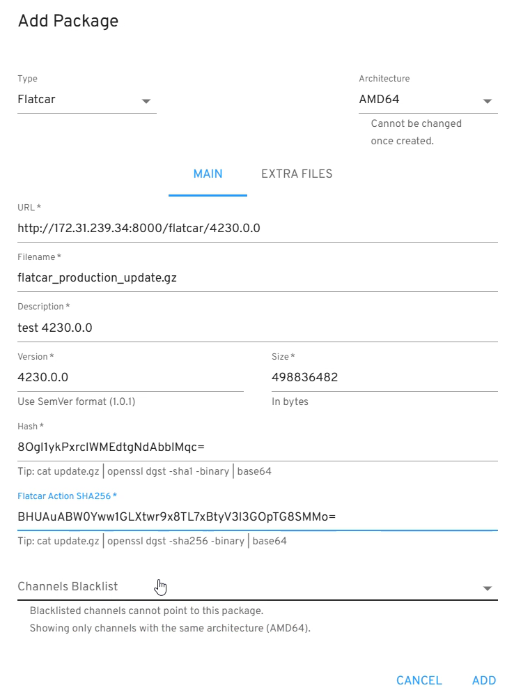

Once you have Nebraska up and running, a common use-case is to manage Flatcar Container Linux updates.

By default, your Flatcar Container Linux instances use the public servers to get updates, so you have to point them to your Nebraska deployment for it to
manage their updates. The process for doing so is slightly different depending on whether you have existing machines or new ones.

## New machines

For new machines, you can set up the updates server in their Container Linux Configuration. Here is a small example of how to do it:


```yaml
variant: flatcar
version: 1.0.0
storage:
  files:
    - path: /etc/flatcar/update.conf
      overwrite: true
      mode: 0644
      contents:
        inline: |
          GROUP=stable
          SERVER=http://your.nebraska.host:port/v1/update/
```

In addition to the default `stable`, `beta` and `alpha` groups, you can also create and use **custom groups** for greater control over the updates.


```yaml
variant: flatcar
version: 1.0.0
storage:
  files:
    - path: /etc/flatcar/update.conf
      overwrite: true
      mode: 0644
      contents:
        inline: |
          GROUP=ab51a000-02dc-4fc7-a6b0-c42881c89856
          SERVER=http://your.nebraska.host:port/v1/update/
```

**Note**: The sample Nebraska containers provided use the `port 8000` by default (**plain HTTP, no SSL**). Please adjust the update URL setup in your servers to match your Nebraska deployment.

**Note**: You must not combine the special `locksmith:` CLC section with the above CLC `files:` section (or a similar one with `/etc/coreos/update.conf`) because it results in a conflict where only one entry wins.

More documentation for the `update.conf` file is [on the Flatcar website](https://www.flatcar.org/docs/latest/setup/releases/update-conf/).

## Existing machines

To update the update server in existing instances please edit `/etc/flatcar/update.conf` and update the `SERVER` value (and optionally `GROUP` if needed):

	SERVER=https://your.nebraska.host/v1/update/

In may take a few minutes to see an update request coming through. If you want to see it sooner, you can force it running this command:

	update_engine_client -update

## Setting a machine alias

The machine alias is an additional name an instance can use when registering in Nebraska.
Since the field is supplied by the instance itself, it's not necessarily unique and can contain arbitrary data.
In the instance list it is shown instead of the instance ID, while on the instance page it is shown in addition to the instance ID.

To add a machine alias to your Flatcar Container Linux instance, you can edit the `/etc/flatcar/update.conf` file or create it on deployment through a Container Linux Configuration:

```yaml
variant: flatcar
version: 1.0.0
storage:
  files:
    - path: /etc/flatcar/update.conf
      mode: 0644
      overwrite: true
      contents:
        inline: |
          MACHINE_ALIAS="myhost a.b.c"
```

The `MACHINE_ALIAS` value can be used without quotes when it contains no whitespace.
For dynamic contents like the IP address, you may write the value through a script:

```
sudo sed -i "/MACHINE_ALIAS=.*/d" /etc/flatcar/update.conf
echo "MACHINE_ALIAS=\"$(hostname) ${MY_IP_ADDR}\"" | sudo tee -a /etc/flatcar/update.conf
```

## Flatcar Container Linux packages in Nebraska

Nebraska is able to periodically poll the public Flatcar Container Linux update servers and create new packages to update the corresponding channels. So if Nebraska is connected to the internet, new packages will show up automatically for the official Flatcar Container Linux. This functionality is optional, and turned off by default. If you
prefer to use it, you should pass the option `-enable-syncer=true` when running Nebraska.

Notice that by default Nebraska only stores metadata about the Flatcar Container Linux updates, not the updates payload. This means that the updates served to your instances contain instructions to download the packages payload from the public Flatcar Container Linux update servers directly, so your servers need access to the Internet to download them.

### Hosting synchronized packages

It is also possible to host the Flatcar Container Linux packages payload in Nebraska. In this case, in addition to get the packages metadata, Nebraska will also download the package payload itself so that it can serve it to your instances when serving updates.

This functionality is turned off by default. So to make Nebraska host the Flatcar Container Linux packages payload, the following options have to be passed to it:

    nebraska -host-flatcar-packages=true -flatcar-packages-path=/PATH/TO/STORE/PACKAGES -nebraska-url=http://your.Nebraska.host:port

#### Hosting without synchronization

You can use Nebraska to host and serve the packages entirely without synchronization. This can be useful for example if you have an isolated environment without internet access (e.g air-gapped environment)

The steps to achieve this are the following:

 1. Create a dedicated directory on the Nebraska server to store the packages: `/PATH/TO/STORE/PACKAGES`
 2. You can find the official packages here: https://update.release.flatcar-linux.net
 3. Download/Upload the packages you want to server to that folder: `wget -o- https://update.release.flatcar-linux.net/{{architecture}}-usr/{{version}}/flatcar_production_update.gz` or alternatively `cp /media/usb/flatcar_production_update.gz /PATH/TO/STORE/PACKAGES/`.
 4. Start your nebraska instance with the following options `nebraska -host-flatcar-packages=true -flatcar-packages-path=/PATH/TO/STORE/PACKAGES -nebraska-url=http://your.Nebraska.host:port`
 5. Register the new package in Nebraska too. Go to your application > Add Package > Fill the form, where the `URL` and the `filename` should match with the options you provided earlier

    For example, if your ip address is `172.31.239.34`, and if the dedicated directory to store the packages is `/tmp/flatcar/`, while the package is in the subdir `/tmp/flatcar/4230.0.0`, you start nebraska with the following params: `-host-flatcar-packages=true`, `-flatcar-packages-path=/tmp/flatcar`, and `-nebraska-url=http://172.31.239.34:8000`, then the filled form should look like:

<p align="center">
  
</p>

 6. Assign the newly added package to your channel
 7. Watch your flatcar nodes getting updates with the selfhosted package

### Overriding synchronized packages' URLs

Some users may choose to host their own packages elsewhere (i.e. without using the
host function explained above), and thus it is desired to synchronize the packages
from upstream but giving them a custom URL for the actual update download.

This can be achieved by setting the `syncer-packages-url` CLI option. This should
be set as a URL, and any `{{VERSION}}` and `{{ARCH}}` keywords in the URL will be
replaced by the packages' version and arch, respectively.

For example:
```bash
nebraska -enable-syncer=true -syncer-packages-url=https://mysepcialstorage.io/flatcar/{{ARCH}}/{{VERSION}}
```

**Note**: To synchronize packages from upstream servers, some users may still rely on the official repository but may want to override the syncer packages URL to bypass a corporate proxy. For such cases, they should always include the -usr suffix in their URL template, as it aligns with the official Flatcar directory naming convention: `-syncer-packages-url=https:///mydomain.example/raw-proxy-flatcar/{{ARCH}}-usr/{{VERSION}}`.

## Managing updates for your own applications

In addition to managing updates for Flatcar Container Linux, you can use Nebraska for other applications as well.

In the [updater directory](https://github.com/flatcar/nebraska/tree/main/updater) there are some sample helpers that can be useful to create your own updaters that talk to Nebraska or even embed them into your own applications. Check out the package docs and the example test files for furhter details.
