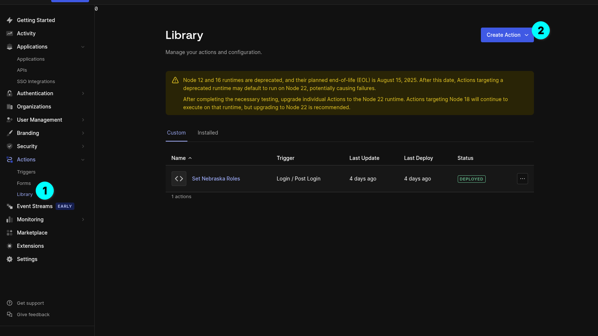
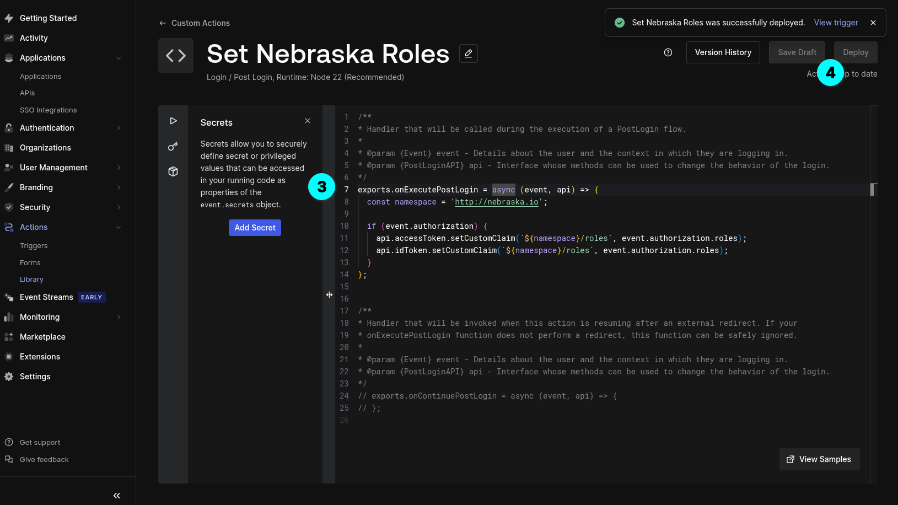
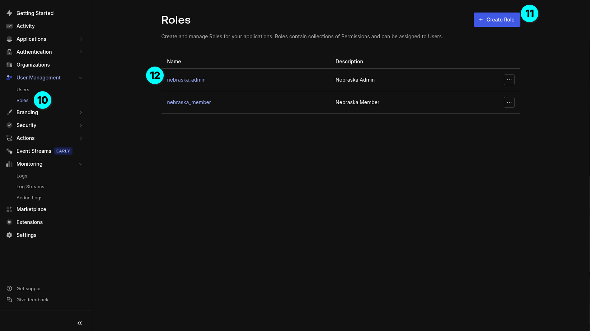

<!-- _class: has-header light-header -->
<!-- _header: Step 1: Create a new application in your Auth0 dashboard -->

---

<!-- _class: has-header light-header -->
<!-- _header: "Step 2: Configure Settings - Add your application's callback URLs (e.g., http://localhost:3000/callback) and logout URLs. These URLs determine where Auth0 redirects users after authentication." -->

---

<!-- _class: has-header light-header -->
<!-- _header: "Step 2: Configure Settings - Add your application's callback URLs (e.g., http://localhost:3000/callback) and logout URLs. These URLs determine where Auth0 redirects users after authentication." -->

---

<!-- _class: has-header light-header -->
<!-- _header: "Step 2: Configure Settings - Add your application's callback URLs (e.g., http://localhost:3000/callback) and logout URLs. These URLs determine where Auth0 redirects users after authentication." -->

---

<!-- _class: has-header light-header -->
<!-- _header: "Step 2: Configure Settings - Add your application's callback URLs (e.g., http://localhost:3000/callback) and logout URLs. These URLs determine where Auth0 redirects users after authentication." -->

---

# Complete!

Your Auth0 setup is now complete and ready to use.

For more details, check the [Auth0 documentation](https://auth0.com/docs)
