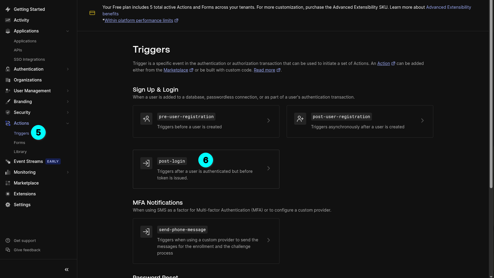
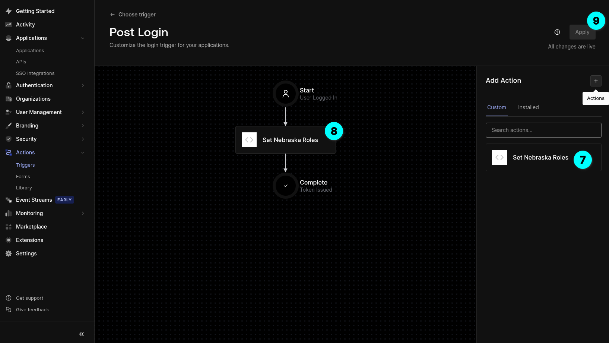

<!-- _footer: "Step 1 & 2: Go to Actions > Library and Create a new Action" -->

---

<!-- _header: "Step 3 & 4: Paste the snippet in the script text box and deploy." -->

---

<!-- _header: "Step 5 & 6: Go to Actions > Triggers and choose 'post-login'." -->

---

<!-- _footer: "Step 7, 8 & 9: Find the newly created action from the right side and drag it in-between the 'Start' and 'Complete' states." -->

---

<!-- _footer: "Step 10, 11 & 12: Go to User Management > Roles and create two new roles, one for admin privileges and another for read only access." -->

---

<!-- _class: light-theme -->

# Complete!

Your Auth0 setup is now ready to use.

For more details, check the [Auth0 documentation](https://auth0.com/docs)
