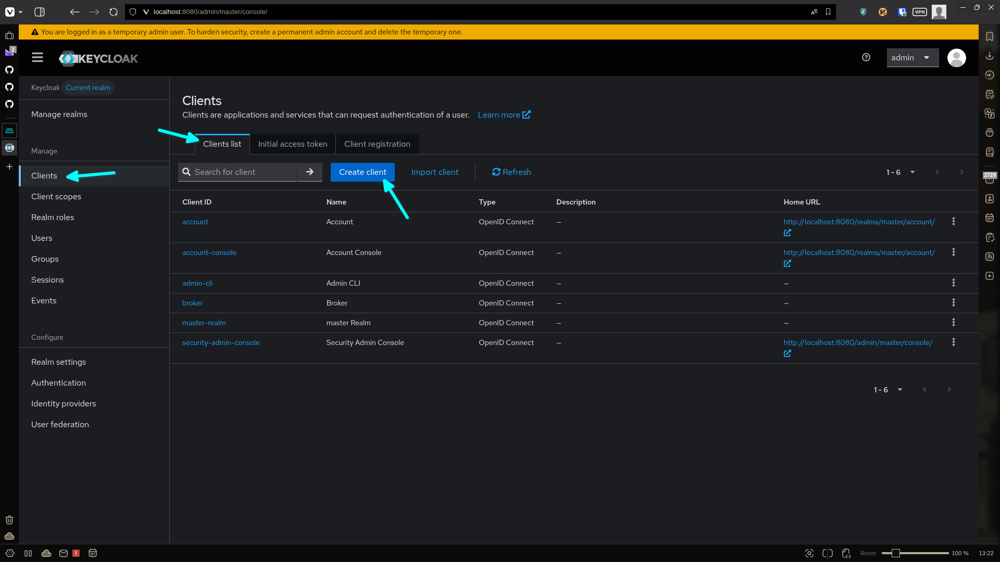
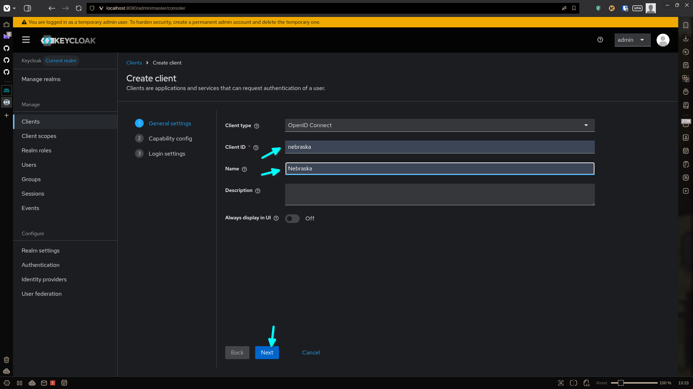
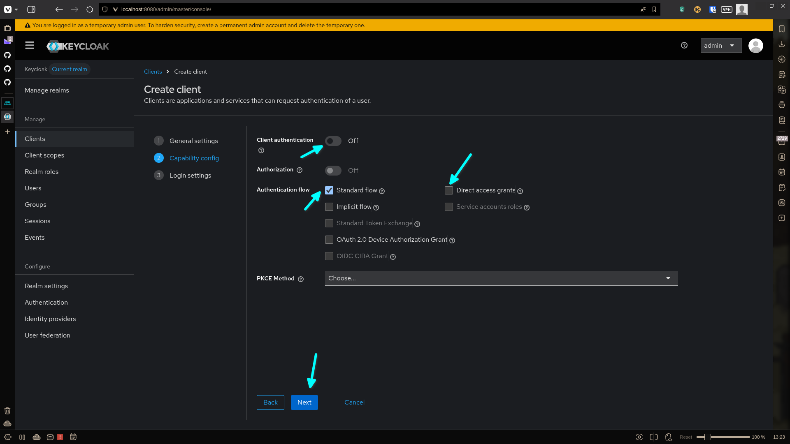
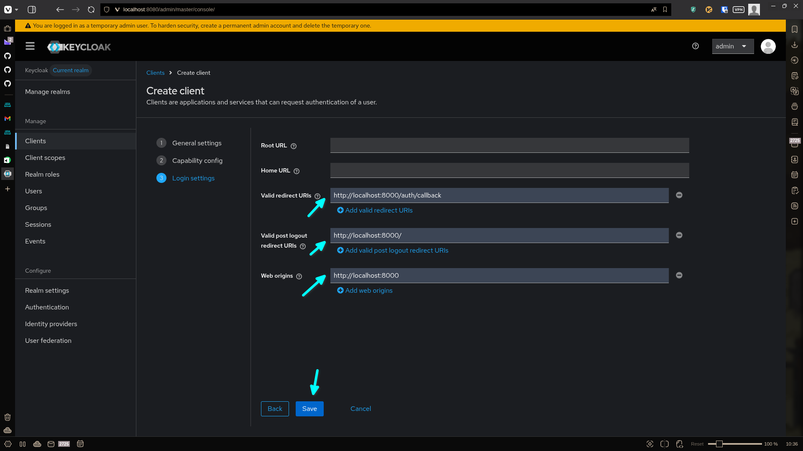
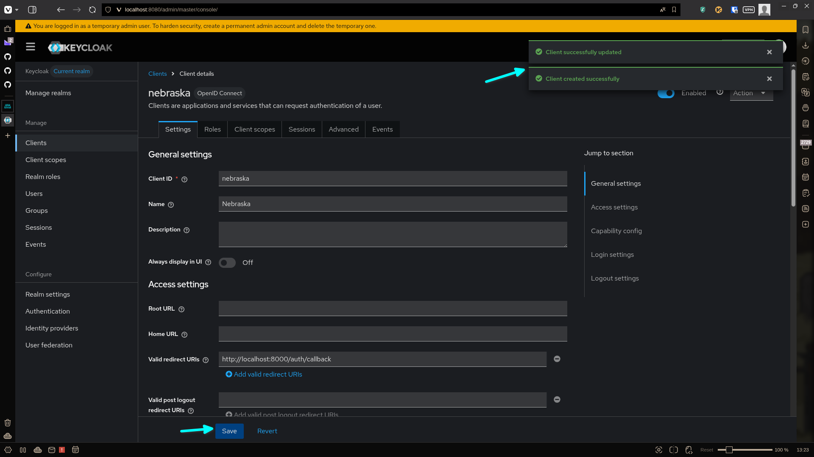

<!-- _footer: "Step 1: Go to Clients > Create client." -->

---

<!-- _header: "Step 2: Define the Client ID as 'nebraska'." -->

---

<!-- _header: "Step 3, 4 & 5: Ensure Standard flow is active, Client authentication is off." -->

---

<!-- _header: "Step 6, 7 & 8: Fill redirect URI and Web origin fields." -->

---

<!-- _footer: "Step 9: Ensure that the settings of your new client got saved." -->

