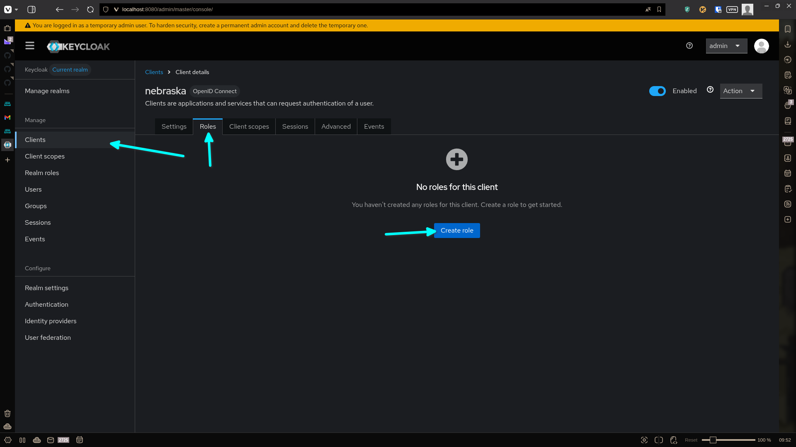
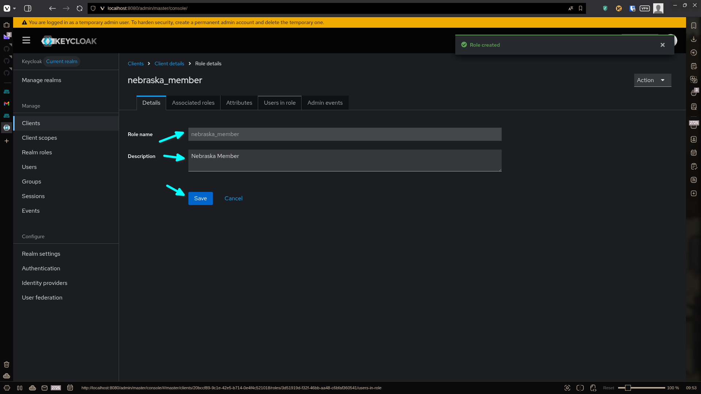
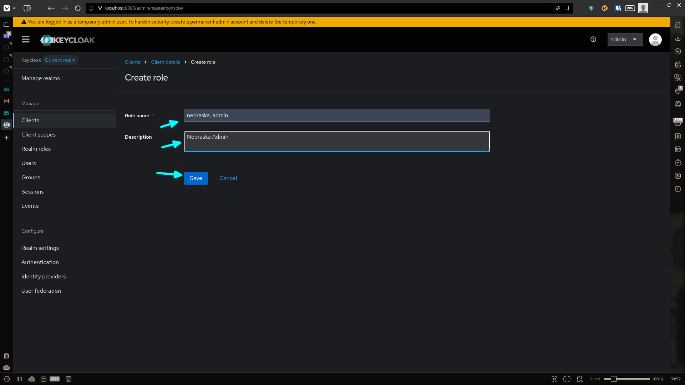
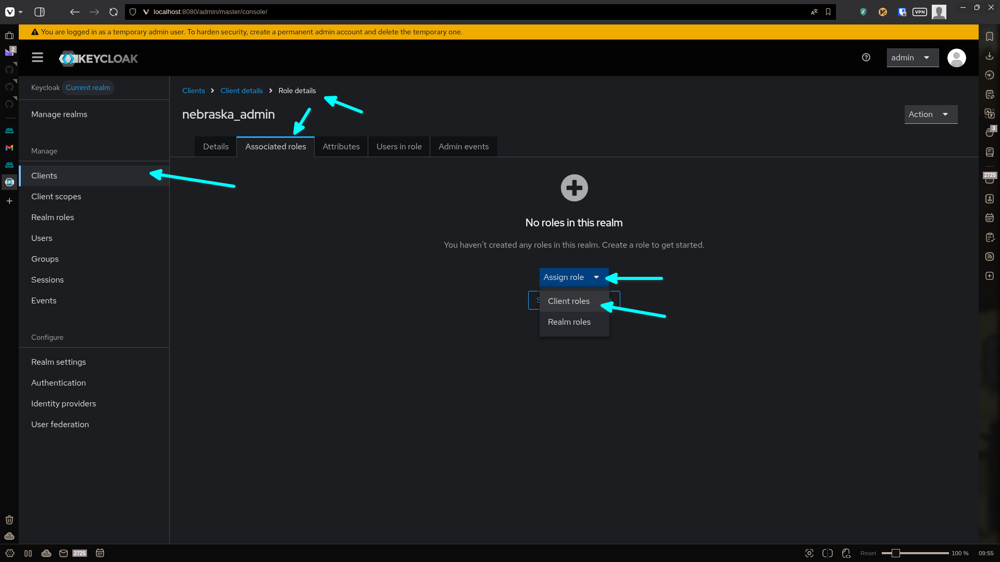
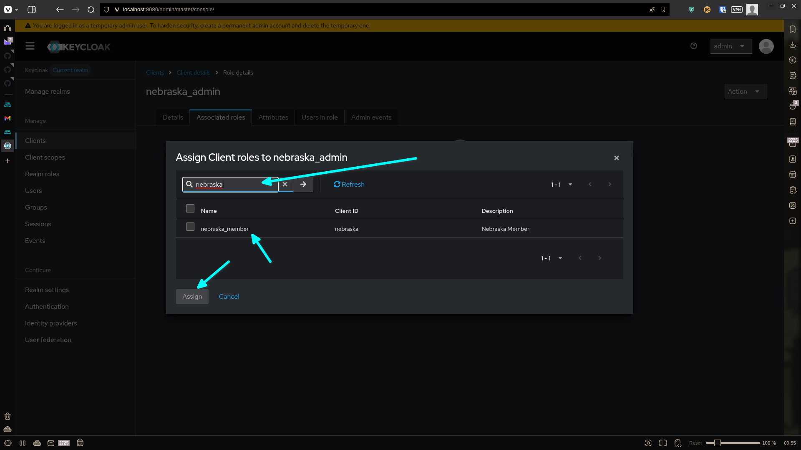

<!-- _footer: "Step 1: Go to Clients > Nebraska." -->

---

<!-- _header: "Step 2: Create the member role." -->

---

<!-- _header: "Step 3: Create the admin role." -->

---

<!-- _header: "Step 4: Go to associated roles." -->

---

<!-- _header: "Step 5: Assign nebraska_member role to nebraska_admin." -->

